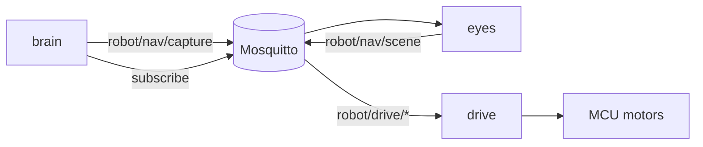

# Smart Puppet

A kid companion robot that **sees**, **moves**, and **talks** on a Jetson Orin.

Three processes share one MQTT bus (Mosquitto). They do not call each other over HTTP in production.

```text
  eyes     see the room          → capture on request; publish robot/nav/scene
  drive    move the base         → robot/drive/cmd | stop | status
  brain    talk with the child   → request capture; Vision: into Gemma
```



## Repositories

| Repo | Role |
|------|------|
| [eyes](https://github.com/smart-puppet/eyes) | Camera, YOLO, metric depth → traversability scene |
| [drive](https://github.com/smart-puppet/drive) | MQTT ↔ UART ↔ MCU (FIFO, watchdog, estop) |
| [brain](https://github.com/smart-puppet/brain) | Voice: Parakeet STT, llama.cpp Gemma, Piper TTS (Kace) |
| [docs](https://github.com/smart-puppet/docs) | Architecture and MQTT topic contracts |

Start with **[docs](https://github.com/smart-puppet/docs)** — especially [architecture](https://github.com/smart-puppet/docs/blob/main/architecture.md) and [MQTT contracts](https://github.com/smart-puppet/docs/blob/main/mqtt.md).

## How it fits together

- **eyes** runs perception on demand (debug Capture button or `robot/nav/capture`), then publishes `hint`, sectors, objects, and a compact BEV costmap on `robot/nav/scene`.
- **brain** (when vision MQTT is enabled) requests a capture when the child asks what it sees, and can **follow a person** or play a first-slice **hide-and-seek** via eyes scenes → short drive nudges ([movement](https://github.com/smart-puppet/docs/blob/main/movement.md)).
- **drive** owns motion safety on the MCU. Clients publish `robot/drive/cmd` / `stop`; status comes back on `robot/drive/status`.

## Typical bring-up

1. Mosquitto  
2. [drive](https://github.com/smart-puppet/drive) host bridge (UART → MCU)  
3. [eyes](https://github.com/smart-puppet/eyes) (Eye) — listens for capture requests  
4. [brain](https://github.com/smart-puppet/brain) for voice (requests captures)  

## Still ahead

- Costmap local planner (step 4 in [movement](https://github.com/smart-puppet/docs/blob/main/movement.md))
- Robot-hides hide-and-seek

Built for Jetson Orin Nano–class hardware. Weights and TensorRT engines are built locally; they are not stored in these repos.
