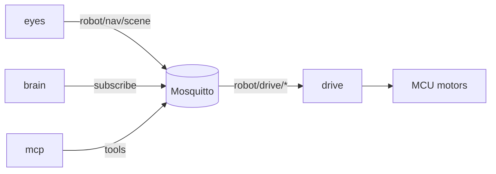

# Smart Puppet

A kid companion robot that **sees**, **moves**, and **talks** on a Jetson Orin — plus an optional agent facade for developers.

Four processes share one MQTT bus (Mosquitto). They do not call each other over HTTP in production.

```text
  eyes     see the room          → publish robot/nav/scene
  drive    move the base         → robot/drive/cmd | stop | status
  brain    talk with the child   → subscribe scene; Vision: into Gemma
  mcp      tools for Cursor      → mirror MQTT (motion gated)
```



## Repositories

| Repo | Role |
|------|------|
| [eyes](https://github.com/smart-puppet/eyes) | Camera, YOLO, metric depth, floor segmentation → traversability scene |
| [drive](https://github.com/smart-puppet/drive) | MQTT ↔ UART ↔ MCU (FIFO, watchdog, estop) |
| [brain](https://github.com/smart-puppet/brain) | Voice: Parakeet STT, llama.cpp Gemma, Piper TTS (Kace) |
| [mcp](https://github.com/smart-puppet/mcp) | Cursor/agent MCP tools over the same MQTT bus |
| [docs](https://github.com/smart-puppet/docs) | Architecture and MQTT topic contracts |

Start with **[docs](https://github.com/smart-puppet/docs)** — especially [architecture](https://github.com/smart-puppet/docs/blob/main/architecture.md) and [MQTT contracts](https://github.com/smart-puppet/docs/blob/main/mqtt.md).

## How it fits together

- **eyes** fuses detections + depth + floor labels into a short `hint`, sector ranges, objects, and a compact BEV costmap on `robot/nav/scene`.
- **brain** (when vision MQTT is enabled) appends that hint to the LLM system prompt so Kace can answer “what’s in front of you?” in kid language. It does not drive yet.
- **drive** owns motion safety on the MCU. Clients publish `robot/drive/cmd` / `stop`; status comes back on `robot/drive/status`.
- **mcp** is a thin facade for agents (`get_scene`, `drive_stop`, gated `drive_cmd`). Realtime publishers remain eyes and drive.

## Typical bring-up

1. Mosquitto  
2. [drive](https://github.com/smart-puppet/drive) host bridge (UART → MCU)  
3. [eyes](https://github.com/smart-puppet/eyes) (debug web or DeepStream) with scene publish  
4. [brain](https://github.com/smart-puppet/brain) for voice  
5. [mcp](https://github.com/smart-puppet/mcp) when an IDE/agent should inspect or nudge the robot  

## Still ahead

- Local planner: costmap → `robot/drive/cmd`  
- Stronger indoor floor segmentation  
- Gemma tool-calling into drive (safely gated)  

Built for Jetson Orin Nano–class hardware. Weights and TensorRT engines are built locally; they are not stored in these repos.
